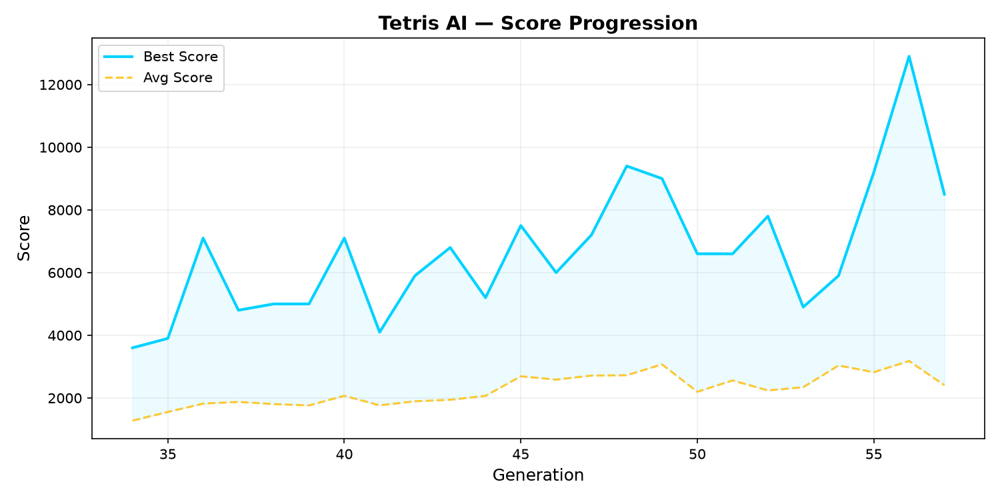
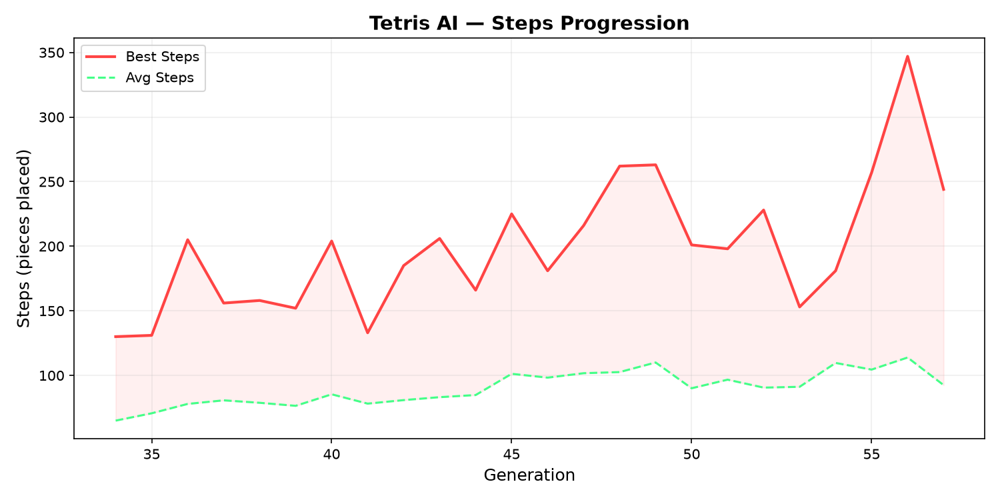
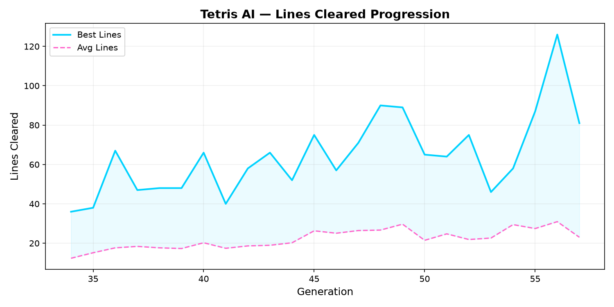

<div align="center">
  <br/>
  
  
  
  
  <br/><br/>

  <h1>🧠 NeuroTris</h1>
  <h3>A self-improving neural network that learns to play Tetris through neuroevolution</h3>
  <p><em>Watch intelligence emerge in real time — no GPU required</em></p>

  <br/>

  <a href="#-architecture">Architecture</a> •
  <a href="#-how-it-works">How It Works</a> •
  <a href="#-installation">Installation</a> •
  <a href="#-usage">Usage</a> •
  <a href="#-project-structure">Structure</a> •
  <a href="#-results">Results</a>

  <br/><br/>
</div>

---

## ✦ Overview

NeuroTris is an **evolutionary AI system** that learns to play Tetris from scratch. A population of neural networks competes, breeds, and mutates over generations — their only goal: maximise the game score. The entire process runs on CPU and is rendered live with Pygame.

```
  ┌─────────────────────────────────────────────────┐
  │  4 games run simultaneously                     │
  │  ↓                                              │
  │  Each game controlled by a neural network       │
  │  ↓                                              │
  │  Network evaluates every possible placement     │
  │  ↓                                              │
  │  Picks the highest-scored one → piece placed    │
  │  ↓                                              │
  │  Game ends → fitness recorded                   │
  │  ↓                                              │
  │  Genetic Algorithm breeds next generation       │
  │  ↓                                              │
  │  Repeat — intelligence improves over time       │
  └─────────────────────────────────────────────────┘
```

---

## ✦ Architecture

### Network Topology

```
 Input (21)        Hidden 1 (20)       Hidden 2 (16)       Output (1)
   ┌───┐              ┌───┐               ┌───┐              ┌───┐
   │ ● │              │ ● │               │ ● │              │ ○ │
   │ ● │    tanh      │ ● │     tanh      │ ● │    linear    │   │
   │ ● │ ───────────→ │ ● │ ────────────→ │ ● │ ────────────→ │ s │
   │ … │  440 params  │ … │   336 params  │ … │   17 params   │   │
   │ ● │              │ ● │               │ ● │              └───┘
   │ ● │              │ ● │               │ ● │
   └───┘              └───┘               └───┘
```

**793 trainable parameters** — lightweight enough for real-time CPU training.

### Mathematical Formulation

Given an input feature vector $\mathbf{x} \in \mathbb{R}^{21}$, the network computes:

$$
\begin{aligned}
\mathbf{h}_1 &= \tanh(\mathbf{W}_1 \mathbf{x} + \mathbf{b}_1) \\[2pt]
\mathbf{h}_2 &= \tanh(\mathbf{W}_2 \mathbf{h}_1 + \mathbf{b}_2) \\[2pt]
s &= \mathbf{W}_3 \mathbf{h}_2 + \mathbf{b}_3
\end{aligned}
$$

where $\mathbf{W}_1 \in \mathbb{R}^{21 \times 20}$, $\mathbf{W}_2 \in \mathbb{R}^{20 \times 16}$, $\mathbf{W}_3 \in \mathbb{R}^{16 \times 1}$, and $s$ is the scalar quality score for a placement.

---

## ✦ Feature Engineering

Every valid placement is simulated (piece locked, lines cleared), and the resulting board is described by **21 normalised features**:

### Column Heights (10)

The height of each of the 10 columns:

$$
h_i = \frac{\text{highest filled cell in column } i}{20}, \quad i = 0, \dots, 9
$$

### Board Metrics

| # | Feature | Formula | Normalisation |
|---|---------|---------|--------------|
| 11 | Holes | $$\sum \text{empty cells with a filled cell above}$$ | ÷100 |
| 12 | Bumpiness | $$\sum_{i=0}^{8} \lvert h_i - h_{i+1} \rvert$$ | ÷180 |
| 13 | Total Height | $$\sum_{i=0}^{9} h_i$$ | ÷200 |
| 14 | Max Height | $$\max_i h_i$$ | ÷20 |
| 15 | Lines Cleared | lines removed by this placement | ÷4 |
| 16 | Filled Cells | total occupied cells | ÷200 |

### Structural Features

| # | Feature | Description | Normalisation |
|---|---------|-------------|--------------|
| 17 | Eroded Cells | $$10 \times \text{lines cleared}$$ — cells removed | ÷40 |
| 18 | Row Transitions | filled→empty transitions across all 20 rows | ÷190 |
| 19 | Column Transitions | filled→empty transitions across all 10 columns | ÷190 |
| 20 | Deep Wells | columns where both neighbours ≥ 2 cells higher | ÷5 |
| 21 | Cumulative Wells | sum of well depths across columns | ÷20 |

Normalisation to $[0, 1]$ accelerates genetic search by placing all features on a common scale.

---

## ✦ Fitness Function

After a game ends, the network's fitness is computed as:

$$
\boxed{\mathcal{F} = 100 \times \text{score} + \text{steps} + 1000 \times \text{lines}}
$$

| Component | Purpose |
|-----------|---------|
| $100 \times \text{score}$ | Primary — rewards the actual game score (100/300/500/800 per line clear) |
| $\text{steps}$ | Secondary — rewards survival; provides gradient even when no lines are cleared |
| $1000 \times \text{lines}$ | Tertiary — strongly incentivises line-clearing behaviour |

**Standard scoring:** single = 100, double = 300, triple = 500, Tetris = 800.

---

## ✦ Genetic Algorithm

### Algorithm

```
POPULATION  ←  40 random networks

for generation = 1 → ∞:
    for each network ∈ POPULATION:
        fitness  ←  simulate_game(network)

    sort POPULATION by fitness (descending)

    ELITE      ←  top 4 (preserved unchanged)
    OFFSPRING  ←  []

    while |OFFSPRING| < 36:
        a  ←  tournament_select(POPULATION, k=4)   ◄─── best of 4 random
        b  ←  tournament_select(POPULATION, k=4)
        child  ←  crossover(a, b)
        mutate(child)
        OFFSPRING  ←  OFFSPRING ∪ {child}

    POPULATION  ←  ELITE ∪ OFFSPRING
```

### Selection — Tournament

Four candidates are drawn uniformly; the fittest becomes a parent. This maintains selection pressure while preserving population diversity.

### Crossover — Uniform

Each weight and bias is inherited from either parent with equal probability:

$$
w_{\text{child}}^{(l)}[i,j] =
\begin{cases}
w_A^{(l)}[i,j] & \text{if } r < 0.5 \\[4pt]
w_B^{(l)}[i,j] & \text{otherwise}
\end{cases}
$$

### Mutation — Adaptive Gaussian

Each parameter is perturbed with probability $p_m$:

$$
w' = w + \varepsilon, \quad \varepsilon \sim \mathcal{N}(0,\, \sigma^2)
$$

Both rate and strength decay with generations to shift from exploration to exploitation:

$$
\begin{aligned}
p_m(g) &= 0.25 \cdot \left(1 - 0.5 \cdot \frac{g}{g+1}\right) \\[4pt]
\sigma(g) &= 0.20 \cdot \left(1 - 0.3 \cdot \frac{g}{g+1}\right)
\end{aligned}
$$

---

## ✦ Results

After approximately 200 generations (~1 hour), the agent consistently scores **2,000–7,000+** points per game.

### Score Progression


*Best and average score per generation. Rapid improvement occurs within the first 20 generations.*

### Survival (Steps Placed)


*Pieces placed before game over. The agent learns to manage the board progressively better.*

### Line Clearing


*Lines cleared per game. Consistent line-clearing emerges after approximately 10 generations.*

> Generate your own charts with: `python plot.py`

---

## ✦ Installation

```bash
# 1. Clone the repository
git clone https://github.com/konpep-dev/tetris_champion.git
cd tetris_champion

# 2. Install dependencies
pip install numpy pygame matplotlib

# 3. Start training
python main.py
```

**Requirements:** Python ≥ 3.9, no GPU needed.

---

## ✦ Usage

| Command | Description |
|---------|-------------|
| `python main.py` | Launch training with live visualisation |
| `python play.py` | Watch the champion play at human speed |
| `python arena.py` | **1v1 — Player vs AI** battle |
| `python plot.py` | Generate training charts from history |

### Controls — Training (`main.py`)

| Key | Action |
|:---:|--------|
| `SPACE` | Pause / resume evolution |
| `↑` `↓` | Increase / decrease simulation speed |
| `S` | Save champion immediately |
| `ESC` | Exit |

### Controls — Replay (`play.py`)

| Key | Action |
|:---:|--------|
| `SPACE` | Pause / resume |
| `ESC` | Exit |

---

## ✦ Project Structure

```
NeuroTris/
│
├── game.py              Tetris engine — 20×10 board, 7 tetrominoes,
│                        collision detection, line clearing
│
├── brain.py             Neural network (21→20→16→1), crossover,
│                        mutation, genetic algorithm orchestrator
│
├── visuals.py           Pygame renderer — game boards, NN architecture
│                        visualisation, statistics panel
│
├── main.py              Training loop with live visualisation
│
├── play.py              Champion replay at human-readable speed
├── arena.py              1v1 — Player vs AI battle
│
├── tracker.py           Logs training metrics to history.md + history.json
│
├── plot.py              Generates matplotlib charts from training history
│
├── tetris_champion.npz  Saved best network (auto-loaded on restart)
├── history.md           Human-readable training log (Markdown table)
├── history.json         Machine-parseable training log (JSON)
│
├── chart_scores.png     Score progression chart
├── chart_steps.png      Steps progression chart
├── chart_lines.png      Lines cleared progression chart
│
├── LICENSE              MIT License
└── README.md            This file
```

---

## ✦ Key Design Decisions

| Decision | Rationale |
|----------|-----------|
| **Neuroevolution over backprop** | No labels needed, no GPU required, inherently parallel, more interpretable |
| **Hand-crafted features** | Compact representation (21 floats) keeps the network tiny (793 params) — trains in real time on CPU |
| **Tournament selection** | Balances exploitation and diversity better than truncation or roulette |
| **Adaptive mutation** | Broad exploration early, fine-grained tuning later — prevents premature convergence |
| **4 simultaneous games** | Maximises screen utilisation without overwhelming the viewer |

---

## ✦ Limitations

- **Feature bottleneck.** The network never sees the raw 20×10 board. Spatial patterns (T-spins, perfect clears) are invisible.
- **No lookahead.** Each placement is scored independently. There is no multi-step planning.
- **Single-game fitness.** One game per network per generation introduces noise. Lucky runs may be over-selected.
- **Score ceiling.** Performance plateaus at 2,000–7,000. True mastery requires a different paradigm.

---

## ✦ Roadmap

- [ ] **Deep Q-Network** — convolutional network on raw board + experience replay
- [ ] **MCTS integration** — Monte Carlo Tree Search for multi-step planning
- [ ] **Multi-game fitness** — average over 3 games per network for smoother evolution
- [ ] **Web version** — JavaScript port with in-browser visualisation

---

<div align="center">
  <br/>
  <hr width="40%"/>
  <p>
    <sub>Built with ❤️ by <a href="https://github.com/konpep-dev">konpep-dev</a></sub>
    <br/>
    <sub>MIT License — use freely, build openly</sub>
  </p>
  <br/>
</div>
